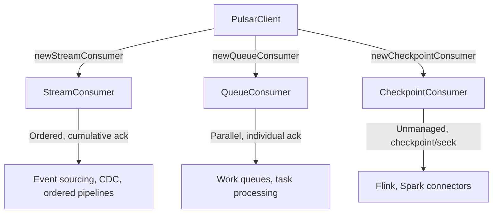
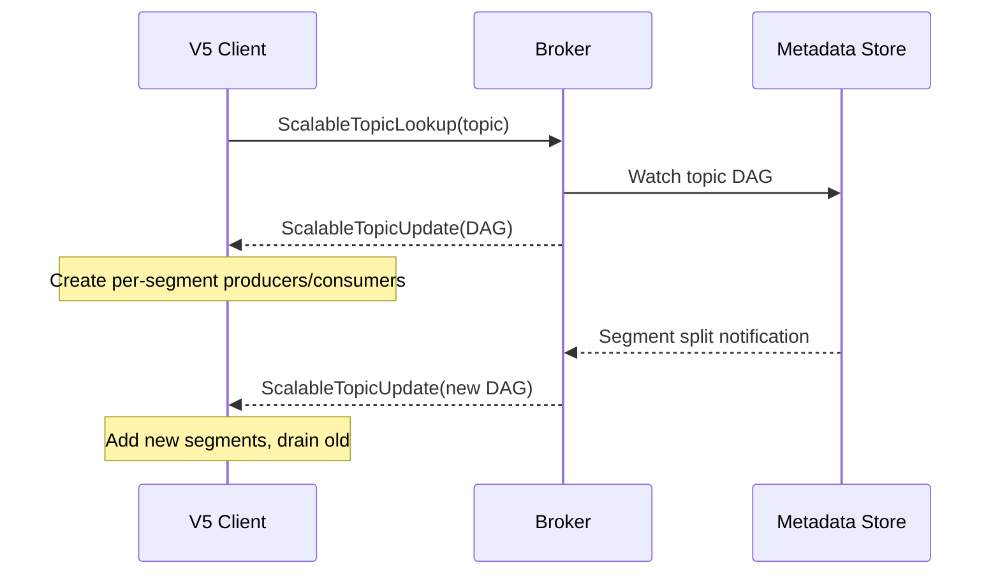

# PIP-466: New Java Client API (V5) with Scalable Topic Support

# Background Knowledge

Apache Pulsar's Java client API (`pulsar-client-api`) has been the primary interface for Java
applications since Pulsar's inception. The API surface has grown organically over the years to
support partitioned topics, multiple subscription types, transactions, schema evolution, and more.

**API versioning precedent.** Pulsar already went through a breaking API redesign in the 2.0
release, where the old API was moved into a separate compatibility module
(`pulsar-client-1x-base`) and the main module was replaced with the new API. This PIP takes
a less disruptive approach: the existing `pulsar-client-api` and `pulsar-client` modules stay
completely unchanged, and the new API is introduced in an additional `pulsar-client-v5` module.
Existing applications are unaffected; new applications can opt in to the V5 API.

**Partitioned topics** are Pulsar's current mechanism for topic-level parallelism. A partitioned
topic is a collection of N independent internal topics (partitions), each backed by a separate
managed ledger. The client is responsible for routing messages to partitions (via `MessageRouter`)
and is exposed to partition-level details through `TopicMessageId`, `getPartitionsForTopic()`,
and partition-specific consumers.

**Subscription types** control how messages are distributed to consumers. Pulsar supports four
types — Exclusive, Failover, Shared, and Key_Shared — all accessed through a single `Consumer`
interface. The interface exposes all operations regardless of which subscription type is in use,
even though some operations (e.g., `acknowledgeCumulative()` on Shared) throw at runtime.

**Scalable topics** ([PIP-460](https://github.com/apache/pulsar/blob/master/pip/pip-460.md)) are a new
server-side mechanism where a topic is composed of a DAG of hash-range segments that can be
dynamically split and merged by the broker. Unlike partitioned topics, the number of segments
is invisible to the client and can change at runtime without application awareness. The client
receives segment layout updates via a dedicated protocol command (DAG watch session) and routes
messages based on hash-range matching. This PIP defines the client API designed to work with
scalable topics; the broker-side design is covered by PIP-460.


# Motivation

## 1. Remove partitioning from the client API

The current API leaks partitioning everywhere: `TopicMessageId` carries partition indexes,
`getPartitionsForTopic()` exposes the count, `MessageRouter` forces the application to make
routing decisions, and consumers can be bound to specific partitions. This forces application
code to deal with what is fundamentally a server-side scalability concern.

With scalable topics, parallelism is achieved via hash-range segments managed entirely by the
broker. The client should treat topics as opaque endpoints — per-key ordering is guaranteed
when a key is specified, but the underlying parallelism (how many segments, which broker owns
each) is invisible and dynamic.

The current API cannot cleanly support this model because partitioning is baked into the type
system (`TopicMessageId`), the builder API (`MessageRouter`, `MessageRoutingMode`), and the
consumer model (partition-specific consumers, `getPartitionsForTopic()`).

## 2. Simplify an oversized API

After years of organic growth, the API surface has accumulated significant baggage:

- `Consumer` has 60+ methods mixing unrelated concerns (ack, nack, seek, pause, unsubscribe,
  stats, get topic name, is connected, etc.)
- `ConsumerBuilder` has 40+ configuration methods with overlapping semantics
- Timeouts use `(long, TimeUnit)` in some places and `long` millis in others
- Nullable returns vs empty — inconsistent across the API
- `loadConf(Map)`, `clone()`, `Serializable` on builders — rarely used, clutters the API
- SPI via reflection hack (`DefaultImplementation`) instead of standard `ServiceLoader`

A new module can start with a clean, minimal surface using modern Java idioms.

## 3. Separate streaming vs queuing consumption

The current `Consumer` mixes all four subscription types behind a single interface:

- `acknowledgeCumulative()` is available but throws at runtime for Shared subscriptions
- `negativeAcknowledge()` semantics differ between modes
- `seek()` behavior varies depending on subscription type
- Dead-letter policy only applies to Shared/Key_Shared

This design means the compiler cannot help you — you discover misuse at runtime. Splitting into
purpose-built consumer types where each exposes only the operations that make sense for its model
improves both usability and correctness.

## 4. Native support for connector frameworks

Connector frameworks like Apache Flink and Apache Spark need to manage their own offsets across
all segments of a topic, take atomic snapshots, and seek back to a checkpoint on recovery. The
current API has no first-class support for this — connectors resort to low-level `Reader` plus
manual partition tracking plus brittle offset management.

A dedicated `CheckpointConsumer` with opaque, serializable `Checkpoint` objects provides a clean
integration point.


## Relationship to PIP-460 and long-term vision

This PIP is a companion to [PIP-460: Scalable Topics](https://github.com/apache/pulsar/blob/master/pip/pip-460.md),
which defines the broker-side segment management, metadata storage, and admin APIs. The V5
client API is the primary interface for applications to use scalable topics — while the
protocol commands and segment routing could theoretically be added to the v4 client, the V5
API was designed from the ground up to support the opaque, dynamically-segmented topic model
that scalable topics provide.

The V5 API is designed to support all use cases currently supported by the existing API:
producing messages, consuming with ordered/shared/key-shared semantics, transactions, schema
evolution, and end-to-end encryption. It is not a subset — it is a full replacement API. It
also works with existing partitioned and non-partitioned topics, so applications can adopt the
new API without changing their topic infrastructure.

The long-term vision is for scalable topics and the V5 API to become the primary model,
eventually deprecating partitioned/non-partitioned topics and the v4 API. However, this
deprecation is explicitly **not** planned for the 5.0 release. The 5.0 release will ship both
APIs side by side, with the V5 API recommended for new applications. A subsequent PIP will
detail the migration path and deprecation timeline.

While this PIP covers the Java client, the same API model (purpose-built consumer types, opaque
topics, checkpoint-based connector support) will also be introduced in non-Java client SDKs
(Python, Go, C++, Node.js) with language-appropriate idioms. Each SDK will mirror the same
concepts and follow the same approach of supporting both old and new topic types side by side.
The non-Java SDKs will be covered by separate PIPs.


# Goals

## In Scope

- A new `pulsar-client-api-v5` module with new Java interfaces for Producer, StreamConsumer,
  QueueConsumer, CheckpointConsumer, and PulsarClient
- A new `pulsar-client-v5` implementation module that wraps the existing v4 client transport
  and adds scalable topic routing
- Support for all use cases currently supported by the existing API (produce, consume with
  ordered/shared/key-shared semantics, transactions, schema, encryption)
- Purpose-built consumer types that separate streaming (ordered, cumulative ack) from queuing
  (parallel, individual ack) from checkpoint (unmanaged, framework-driven)
- Opaque topic model where partition/segment details are hidden from the application
- Modern Java API conventions: `Duration`, `Instant`, `Optional`, records, `ServiceLoader`
- First-class transaction support in the main package
- DAG watch protocol integration for live segment layout updates

## Out of Scope

- Changes to the existing `pulsar-client-api` — it remains fully supported and unchanged
- Changes to the wire protocol beyond what is needed for scalable topic DAG watch
- Broker-side scalable topic management (split/merge algorithms, load balancing) — covered by
  [PIP-460](https://github.com/apache/pulsar/blob/master/pip/pip-460.md) and subsequent more
  specific PIPs
- Migration path from v4 to v5 API — will be detailed in a subsequent PIP
- Implementation details — this PIP focuses on the public API surface
- Deprecation of the existing API or partitioned/non-partitioned topic types
- TableView equivalent in v5 — may be added in a follow-up PIP


# High Level Design

The V5 client API is shipped as two new modules alongside the existing client:

```
pulsar-client-api-v5    (interfaces and value types only — no implementation)
pulsar-client-v5        (implementation, depends on pulsar-client for transport)
```

The existing `pulsar-client-api` and `pulsar-client` modules are unchanged. Applications
can use v4 and v5 in the same JVM.

## Entry point

```java
PulsarClient client = PulsarClient.builder()
        .serviceUrl("pulsar://localhost:6650")
        .build();
```

The `PulsarClient` interface provides builder methods for all producer/consumer types:

```
PulsarClient
  .newProducer(schema)            -> ProducerBuilder    -> Producer<T>
  .newStreamConsumer(schema)      -> StreamConsumerBuilder -> StreamConsumer<T>
  .newQueueConsumer(schema)       -> QueueConsumerBuilder  -> QueueConsumer<T>
  .newCheckpointConsumer(schema)  -> CheckpointConsumerBuilder -> CheckpointConsumer<T>
  .newTransaction()               -> Transaction
```

## Consumer types

Instead of a single `Consumer` with a `SubscriptionType` enum, the V5 API provides three
distinct consumer types:



**StreamConsumer** — Ordered consumption with cumulative acknowledgment. Maps to
Exclusive/Failover subscription semantics. Messages are delivered in order (per-key when keyed).

**QueueConsumer** — Unordered parallel consumption with individual acknowledgment. Maps to
Shared/Key_Shared subscription semantics. Includes dead-letter policy, ack timeout, and
redelivery backoff.

**CheckpointConsumer** — Unmanaged consumption for connector frameworks. No subscription, no
ack — position tracking is entirely external. Provides `checkpoint()` for atomic position
snapshots and `seek(Checkpoint)` for recovery.

## Scalable topic integration

When a V5 client connects to a `topic://` domain topic, it establishes a DAG watch session
with the broker. The broker sends the current segment layout (which segments exist, their
hash ranges, and which broker owns each) and pushes updates when the layout changes (splits,
merges).



The `Producer` hashes message keys to determine which segment to send to, maintaining one
internal producer per active segment. When segments split or merge, the client transparently
creates new internal producers and drains old ones.

## Sync/async model

All types are sync-first with an `.async()` accessor:

```java
Producer<T>            -> producer.async()   -> AsyncProducer<T>
StreamConsumer<T>      -> consumer.async()   -> AsyncStreamConsumer<T>
QueueConsumer<T>       -> consumer.async()   -> AsyncQueueConsumer<T>
CheckpointConsumer<T>  -> consumer.async()   -> AsyncCheckpointConsumer<T>
Transaction            -> txn.async()        -> AsyncTransaction
```

Both views share the same underlying resources.


# Detailed Design

## Design & Implementation Details

### Module structure

```
pulsar-client-api-v5/
  org.apache.pulsar.client.api.v5
  ├── PulsarClient, PulsarClientBuilder, PulsarClientException
  ├── Producer, ProducerBuilder
  ├── StreamConsumer, StreamConsumerBuilder
  ├── QueueConsumer, QueueConsumerBuilder
  ├── CheckpointConsumer, CheckpointConsumerBuilder, Checkpoint
  ├── Message, Messages, MessageId, MessageMetadata, MessageBuilder
  ├── Transaction
  ├── async/       (AsyncProducer, AsyncMessageBuilder, Async*Consumer, AsyncTransaction)
  ├── auth/        (Authentication, AuthenticationData, CryptoKeyReader, ...)
  ├── config/      (BatchingPolicy, CompressionPolicy, TlsPolicy, BackoffPolicy, ...)
  ├── schema/      (Schema, SchemaInfo, SchemaType)
  └── internal/    (PulsarClientProvider — ServiceLoader SPI)

pulsar-client-v5/
  org.apache.pulsar.client.impl.v5
  ├── PulsarClientV5, PulsarClientBuilderV5, PulsarClientProviderV5
  ├── ScalableTopicProducer, ProducerBuilderV5
  ├── ScalableStreamConsumer, StreamConsumerBuilderV5
  ├── ScalableQueueConsumer, QueueConsumerBuilderV5
  ├── ScalableCheckpointConsumer, CheckpointConsumerBuilderV5
  ├── DagWatchClient, ClientSegmentLayout, SegmentRouter
  ├── SchemaAdapter, AuthenticationAdapter, CryptoKeyReaderAdapter
  ├── MessageV5, MessageIdV5, MessagesV5, CheckpointV5
  └── Async*V5 wrappers
```

### Key types

**`MessageMetadata<T, BUILDER>`** — A self-referential builder base shared between sync and
async message sending:

```java
interface MessageMetadata<T, BUILDER extends MessageMetadata<T, BUILDER>> {
    BUILDER value(T value);
    BUILDER key(String key);
    BUILDER property(String name, String value);
    BUILDER eventTime(Instant eventTime);
    BUILDER deliverAfter(Duration delay);
    BUILDER deliverAt(Instant timestamp);
    BUILDER transaction(Transaction txn);
}
```

`MessageBuilder<T>` extends it with `MessageId send()`.
`AsyncMessageBuilder<T>` extends it with `CompletableFuture<MessageId> send()`.

**`Checkpoint`** — Opaque, serializable position vector across all segments:

```java
interface Checkpoint {
    byte[] toByteArray();
    Instant creationTime();

    static Checkpoint earliest();
    static Checkpoint latest();
    static Checkpoint atTimestamp(Instant timestamp);
    static Checkpoint fromByteArray(byte[] data);
}
```

Internally, a `Checkpoint` stores a `Map<Long, MessageId>` mapping segment IDs to positions.
The format is forward-compatible — checkpoints saved with fewer segments can be applied after
splits/merges.

**Configuration records** — Immutable records with static factories:

| Record | Purpose | Example |
|--------|---------|---------|
| `BatchingPolicy` | Batching config | `BatchingPolicy.of(Duration.ofMillis(10), 5000, MemorySize.ofMB(1))` |
| `CompressionPolicy` | Compression codec | `CompressionPolicy.of(CompressionType.ZSTD)` |
| `TlsPolicy` | TLS/mTLS config | `TlsPolicy.of("/path/to/ca.pem")` |
| `BackoffPolicy` | Retry backoff | `BackoffPolicy.exponential(Duration.ofMillis(100), Duration.ofSeconds(30))` |
| `DeadLetterPolicy` | Dead letter queue | `DeadLetterPolicy.of(5)` |
| `EncryptionPolicy` | E2E encryption | `EncryptionPolicy.forProducer(keyReader, "mykey")` |
| `ChunkingPolicy` | Large msg chunking | `ChunkingPolicy.of(MemorySize.ofMB(10))` |

### SPI discovery

Implementation is loaded via `java.util.ServiceLoader`:

```java
// In pulsar-client-api-v5
public interface PulsarClientProvider {
    PulsarClientBuilder newClientBuilder();
    <T> Schema<T> jsonSchema(Class<T> clazz);
    // ... factory methods for all SPI types
}

// In pulsar-client-v5
// META-INF/services/org.apache.pulsar.client.api.v5.internal.PulsarClientProvider
// -> org.apache.pulsar.client.impl.v5.PulsarClientProviderV5
```

This replaces the reflection-based `DefaultImplementation` approach used in the current API.

## Public-facing Changes

### Public API

This PIP introduces a new public Java API. The existing `pulsar-client-api` is unchanged.

**New modules:**
- `pulsar-client-api-v5` — interfaces and value types (compile dependency for applications)
- `pulsar-client-v5` — implementation (runtime dependency)

**New interfaces (summary):**

| Interface | Methods | Description |
|-----------|---------|-------------|
| `PulsarClient` | `builder()`, `newProducer()`, `newStreamConsumer()`, `newQueueConsumer()`, `newCheckpointConsumer()`, `newTransaction()`, `close()` | Entry point |
| `Producer<T>` | `newMessage()`, `flush()`, `close()`, `async()` | Send messages |
| `StreamConsumer<T>` | `receive()`, `receive(Duration)`, `acknowledgeCumulative()`, `close()`, `async()` | Ordered consumption |
| `QueueConsumer<T>` | `receive()`, `receive(Duration)`, `acknowledge()`, `negativeAcknowledge()`, `close()`, `async()` | Parallel consumption |
| `CheckpointConsumer<T>` | `receive()`, `receive(Duration)`, `checkpoint()`, `seek()`, `close()`, `async()` | Framework consumption |

### Configuration

No new broker configuration is introduced by this PIP. The V5 client reuses the existing
`ClientConfigurationData` internally.

### CLI

No new CLI commands specific to the V5 API.

### Metrics

No new metrics are introduced by the V5 client API itself. The underlying v4 producers and
consumers continue to emit their existing metrics.


# Monitoring

The V5 client wraps v4 producers and consumers internally, so existing producer/consumer
metrics (publish rate, latency, backlog, etc.) continue to work. Each internal segment
producer/consumer appears as a separate instance in metrics, identified by the segment topic
name.

Operators should monitor:
- Per-segment publish rates to detect hot segments (candidates for splitting)
- DAG watch session reconnections (indicates broker restarts or network issues)
- Segment producer creation/closure events in client logs during split/merge operations


# Security Considerations

The V5 client API does not introduce new security mechanisms. It delegates all authentication
and authorization to the underlying v4 client:

- Authentication is configured via `PulsarClientBuilder.authentication()` and delegated to the
  v4 `AuthenticationProvider` framework via `AuthenticationAdapter`
- Topic-level authorization applies to the parent `topic://` name — accessing the underlying
  `segment://` topics uses the same tenant/namespace permissions
- End-to-end encryption is supported via `EncryptionPolicy` on `ProducerBuilder`, delegated to
  the v4 `CryptoKeyReader` framework via `CryptoKeyReaderAdapter`
- The new `CommandScalableTopicLookup` protocol command is sent only after the connection is
  authenticated and in the `Connected` state, consistent with other lookup commands

No new REST endpoints are introduced by the client API itself.


# Backward & Forward Compatibility

## Upgrade

The V5 API is a new, additive module. No changes are required to existing applications.
This follows the same approach as the 2.0 API redesign, where the old API was preserved in a
separate compatibility module — except this time there is no breaking change at all. The
existing API is unchanged and existing applications require no modifications.

- Applications using `pulsar-client-api` (v4) continue to work without modification
- New applications can adopt the V5 API by depending on `pulsar-client-v5`
- The V5 API works with all topic types: scalable topics, partitioned topics, and
  non-partitioned topics — applications can migrate to the new API without changing their
  topic infrastructure
- Both APIs can coexist in the same JVM — the V5 implementation wraps the v4 transport
  internally
- A detailed migration path from v4 to v5 will be provided in a subsequent PIP
- A seamless migration path to convert existing partitioned and non-partitioned topics to
  scalable topics will also be provided, allowing applications to transition their topic
  infrastructure without data loss or downtime

To adopt the V5 API, applications add `pulsar-client-v5` as a dependency and use
`PulsarClient.builder()` from the `org.apache.pulsar.client.api.v5` package.

## Downgrade / Rollback

Since the V5 API is a separate module, rollback is simply removing the dependency and reverting
to v4 API calls. No broker-side changes are required.

Applications using `CheckpointConsumer` should note that saved `Checkpoint` byte arrays are
specific to the V5 implementation and cannot be used with v4 `Reader`/`Consumer`.

## Pulsar Geo-Replication Upgrade & Downgrade/Rollback Considerations

The V5 client API itself does not introduce geo-replication concerns — it connects to whichever
cluster it is configured for. However, geo-replication of scalable topics has specific
considerations (segment layout synchronization across clusters, cross-cluster split/merge
coordination) that will be detailed in a subsequent PIP.


# Alternatives

## Extend the existing Consumer interface

We considered adding scalable topic support to the existing `Consumer` interface by adding new
methods for checkpoint/seek and hiding segment details internally. This was rejected because:

- The existing interface already has 60+ methods and is difficult to evolve
- Adding checkpoint semantics alongside ack semantics would further confuse the API
- The type system cannot prevent misuse (e.g., calling `acknowledgeCumulative()` on a Shared
  subscription)
- Removing partition-related methods (`TopicMessageId`, `MessageRouter`) would break backward
  compatibility

## Builder-per-subscription-type on existing API

We considered keeping a single `Consumer` type but using different builder types per subscription
mode (e.g., `StreamConsumerBuilder` returning a `Consumer` with restricted methods). This was
rejected because the returned `Consumer` would still expose all methods at the type level — the
restriction would only be in documentation, not enforced by the compiler.

## Separate module vs extending existing module

We chose a separate module (`pulsar-client-api-v5`) rather than adding new interfaces to
`pulsar-client-api` because:

- The v5 API uses different naming conventions (`value()` vs `getValue()`), different types
  (`Duration` vs `(long, TimeUnit)`), and different patterns (`Optional` vs nullable)
- Having both conventions in the same package would be confusing
- A clean module boundary makes it clear which API generation an application is using
- The v4 API can eventually be deprecated without affecting v5 users


# General Notes

The V5 API targets Java 17, the same as the rest of Pulsar.

The implementation module (`pulsar-client-v5`) wraps the existing v4 `pulsar-client` for all
transport-level operations. This means bug fixes and performance improvements to the v4 client
automatically benefit V5 users, and the V5 module itself is relatively thin — primarily routing
logic and API adaptation.


# Links

* Mailing List discussion thread:
* Mailing List voting thread:
